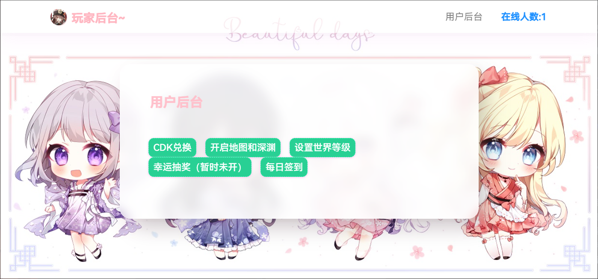
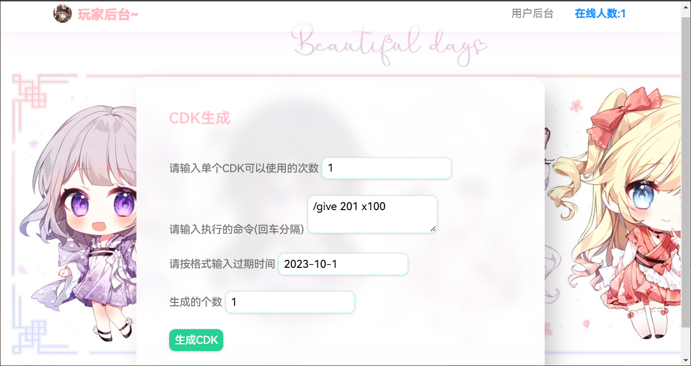

# Grasscutter-CDKeySystem - Grasscutter 外置CDKey



Grasscutter-CDKeySystem 是一个 [Grasscutter](https://github.com/Grasscutters/Grasscutter) 外置系统, 你可以用它来轻松的兑换和分发游戏的CDKey


推荐使用 Grasscutter 命令生成工具:
[GrasscutterCommandGenerator](https://github.com/jie65535/GrasscutterCommandGenerator)

## 💡Feature

- [x] **CDKey兑换**  - 玩家可以兑换已经生成的CDKey.
- [x] **CDKey生成**  - 管理者可以生成CDKey的内容，支持批量生成。
- [X] **开启地图和深渊**  - 玩家可以一键开启地图和深渊.
- [X] **设置世界等级**  - 玩家可以任意设置世界等级.
- [ ] **幸运抽奖**  - 抽奖系统.
- [ ] **每日签到**  - 签到系统.
- [ ] **更多**  - Comming soon...

## 🍗Setup
### 安装
 >本项目基于 [opencommand-plugin](https://github.com/jie65535/gc-opencommand-plugin) 插件
 
1. [下载opencommand插件](https://github.com/jie65535/gc-opencommand-plugin/releases)
2. 把插件放进你的Grasscutter服务器的 `plugins` 文件夹。
3. 启动服务器，插件会自动在你的服务器插件文件夹下生成 `opencommand-plugin` 文件夹。
4. 打开 `opencommand-plugin` 文件夹，打开并编辑 `config.json`。
5. 设置 `consoleToken` 的值为你的连接秘钥，建议使用至少32字符的长随机字符串。
6. 安装Python3和依赖包：
```shell
pip install django==3.2 requests
```
7. 下载本仓库到服务器，打开并编辑`app`文件夹里的`CONSTANTS.py`文件。
8. 设置服务器地址、opencommand的Token和自定义密码，保存
```python
# 设置服务器open-command的token
Server_token = 'token_value'

# 设置服务器地址，不带http和/
Server_addr = 'https://127.0.0.1'

# 设置MeaMail插件的邮件模板文件夹（暂不需要）
MeaMail_addr = r'plugins\MeaMailPlus\template'

# 设置登录认证的密码
auth_pwd = 'jixiaob'
```
9. 在项目目录运行
```shell
python manage.py runserver 0.0.0.0:8000
```
即可在8000端口访问到页面。


### 使用
设置CDKey的地址：/cdk_create

进入需要验证密码，即刚刚设置的`auth_pwd`


可以设置单个CDKey的使用次数

执行的命令可以是give，当然也可以是其他的命令，多条命令用回车隔开。

推荐使用 Grasscutter 命令生成工具:
[GrasscutterCommandGenerator](https://github.com/jie65535/GrasscutterCommandGenerator)

过期时间必须按格式填写，否则会报错

生成的个数可以填多个就可以批量生成，但是不要过多。

生成速度取决于服务器性能。
